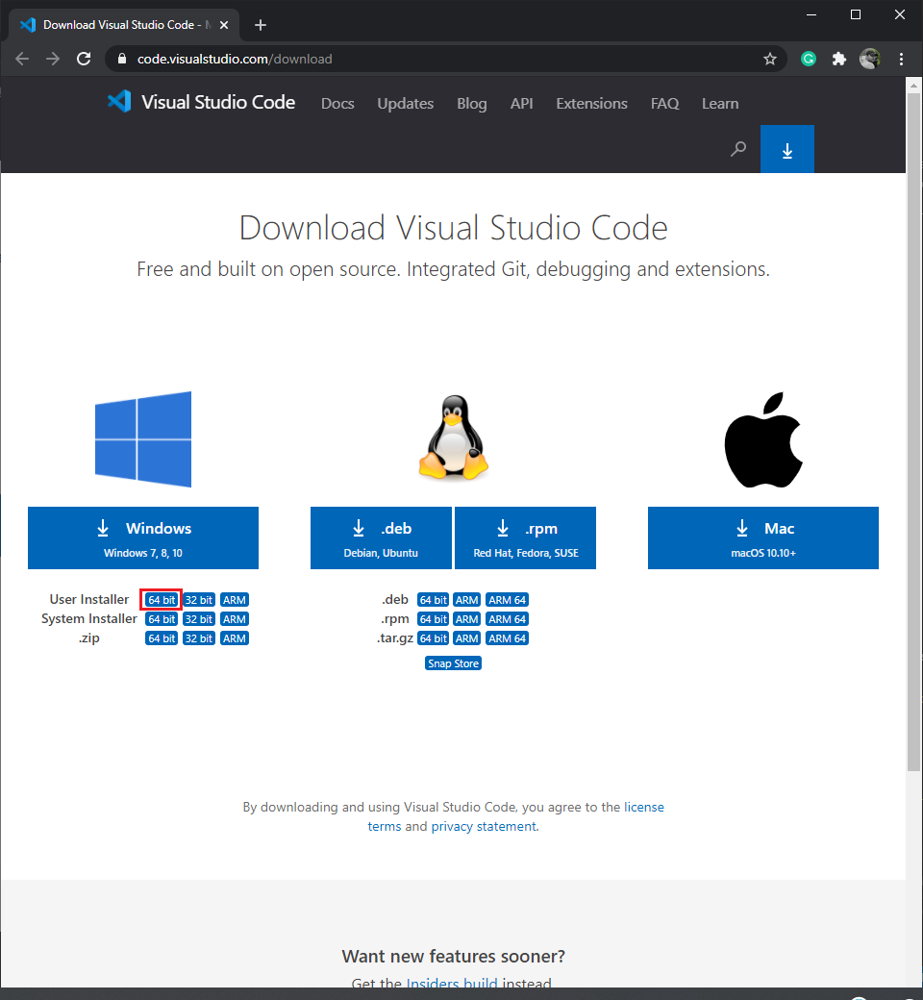
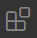
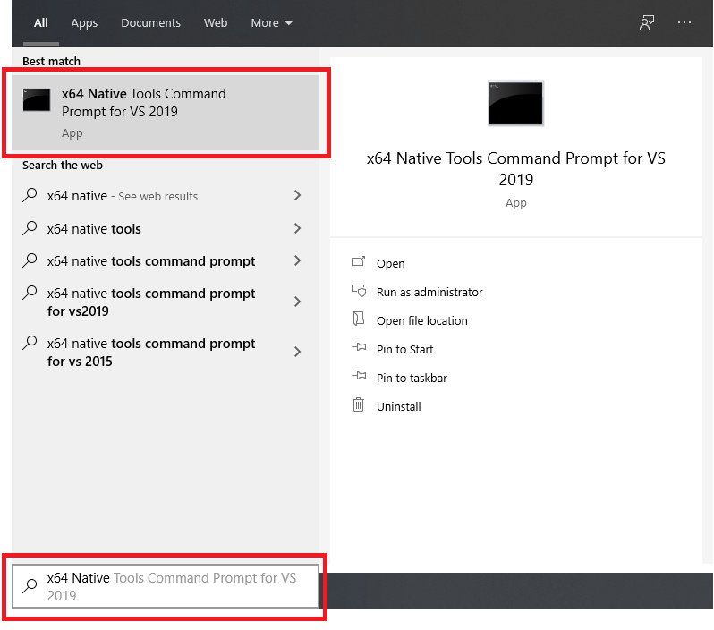
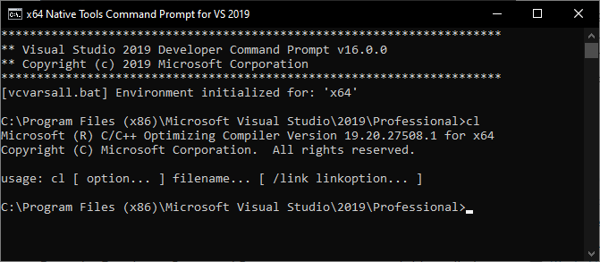
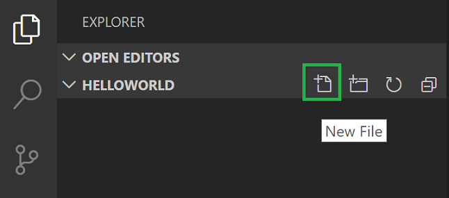
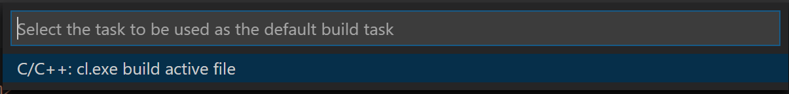
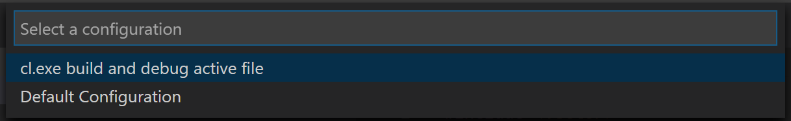

# Code OpenCV using VS Code on Windows

In this blog, we explain how to configure Visual Studio Code to use Microsoft Visual C++ compiler and debugger on windows for building and debugging OpenCV application.

After configuring VS code, we will build and debug a simple OpenCV based video capture application.

## Contents

- [Step 0: Prerequisites](#step-0-prerequisites)
- [Step 1: Install Visual Studio Code](#step-1-install-visual-studio-code)
- [Step 2: Install C/C++ extension for VS Code](#step-2-install-cc-extension-for-vs-code)
- [Step 3: Check Microsoft Visual C++ installation](#step-3-check-microsoft-visual-c-installation)
- [Step 4: Open project directory in VS Code](#step-4-open-project-directory-in-vs-code)
- [Step 5: Implement the application](#step-5-implement-the-application)
- [Step 6: Compiler path and IntelliSense settings](#step-6-compiler-path-and-intellisense-settings)
- [Step 7: Build the application](#step-7-build-the-application)
- [Step 8: Debug the application](#step-8-debug-the-application)

## Step 0: Prerequisites

Throughout the blog, we assume that you have

1. Installed **Visual Studio 16 2019** with C++ workload
2. Installed **OpenCV 4.5.0** in `C:\` folder using the installers

## Step 1: Install Visual Studio Code

1. Go to Visual Studio Code [download page](https://code.visualstudio.com/download) and download **User Installer** for window 64 bit



2. Once it is downloaded, run the installer (`VSCodeUserSetup-{version}.exe`).

## Step 2: Install C/C++ extension for VS Code

1. Start VS code

2. Go to Extensions view by clicking on  icon or pressing (`Ctrl+Shift+X`)

3. Install the C/C++ exension by searching for 'c++'


4. Close VS code

## Step 3: Check Microsoft Visual C++ installation

1. Open the `x64 Native Tools Command Prompt for VS 2019` by typing `x64 Native` in the Windows Start menu, and you should see it appear in the list of suggestions. Click on the item to open the prompt.



2. You can test that you have the C++ compiler, `cl.exe`, installed correctly by typing `cl` and you should see a copyright message with the version and basic usage description.



## Step 4: Open project directory in VS Code

From the `x64 Native Tools Command Prompt for VS 2019` navigate to your project directory and open VS Code (`code`) in that folder (`.`) by entering the following command

```bash
code .
```

The `code .` command opens VS Code in the current working folder, which becomes your `workspace`.

## Step 5: Implement the application

### 5.1 Add a source code file

In the File Explorer title bar, select the New File button and name the file `videocapture.cpp`.



### 5.2 Add video capture source code

Now paste in following source code for video capture application

```cpp
#include <opencv2/core.hpp>
#include <opencv2/videoio.hpp>
#include <opencv2/highgui.hpp>
#include <iostream>
#include <stdio.h>

using namespace cv;
using namespace std;

int main(int, char**)
{
    Mat frame;
    //--- INITIALIZE VIDEOCAPTURE
    VideoCapture cap;
    // open the default camera using default API
    // cap.open(0);
    // OR advance usage: select any API backend
    int deviceID = 0;             // 0 = open default camera
    int apiID = cv::CAP_ANY;      // 0 = autodetect default API
    // open selected camera using selected API
    cap.open(deviceID, apiID);
    // check if we succeeded
    if (!cap.isOpened()) {
        cerr << "ERROR! Unable to open camera\n";
        return -1;
    }

    //--- GRAB AND WRITE LOOP
    cout << "Start grabbing" << endl
        << "Press any key to terminate" << endl;
    for (;;)
    {
        // wait for a new frame from camera and store it into 'frame'
        cap.read(frame);
        // check if we succeeded
        if (frame.empty()) {
            cerr << "ERROR! blank frame grabbed\n";
            break;
        }
        // show live and wait for a key with timeout long enough to show images
        imshow("Live", frame);
        if (waitKey(5) >= 0)
            break;
    }
    // the camera will be deinitialized automatically in VideoCapture destructor
    return 0;
}
```

> Note: Currently you will be seeing red wriggle underline for first three opencv include lines because the IntelliSense of VS Code is not able to locate these file in our workspace and in the standard library path.

## Step 6: Compiler path and IntelliSense settings

Next, we will create a `c_cpp_properties.json` file, which will allow us to change settings such as the path to the compiler, include paths, C++ standard (default is C++17), and more.

By running the command **C/C++: Edit Configurations (JSON)** from the Command Palette (`Ctrl+Shift+P`), it will create a
`c_cpp_properties.json` file in a `.vscode` folder and open it in the editor.


Your new `c_cpp_properties.json` file should look similar to the JSON below:

```json
{
  "configurations": [
    {
      "name": "Win32",
      "includePath": ["${workspaceFolder}/**"],
      "defines": ["_DEBUG", "UNICODE", "_UNICODE"],
      "windowsSdkVersion": "10.0.17763.0",
      "compilerPath": "C:/Program Files (x86)/Microsoft Visual Studio/2019/Professional/VC/Tools/MSVC/14.20.27508/bin/Hostx64/x64/cl.exe",
      "cStandard": "c17",
      "cppStandard": "c++17",
      "intelliSenseMode": "windows-msvc-x64"
    }
  ],
  "version": 4
}
```

We need to add path to opencv header file `C:/OpenCV/include` to the `includePath` array setting as our program include opencv header files that are not in our workspace or in the standard library path.

```json
{
  "configurations": [
    {
      "name": "x64", // config name, you can name this whatever you like
      "includePath": [
        "${workspaceFolder}/**",
        "C:/OpenCV/include" // path to opencv include directory
      ],
      "defines": ["_DEBUG", "UNICODE", "_UNICODE"],
      "windowsSdkVersion": "10.0.17763.0",
      "compilerPath": "C:/Program Files (x86)/Microsoft Visual Studio/2019/Professional/VC/Tools/MSVC/14.20.27508/bin/Hostx64/x64/cl.exe",
      "cStandard": "c17",
      "cppStandard": "c++17",
      "intelliSenseMode": "windows-msvc-x64"
    }
  ],
  "version": 4
}
```

> Note: At this point red wriggle underline for first three opencv include lines will disapper.

## Step 7: Build the application

Next, we will create a `tasks.json` file to tell VS Code how to build (compile) the program. This task will invoke the Microsoft C++ compiler to create an executable file based on the source code.

### 7.1 Create and configure `tasks.json`

From the main menu, choose **Terminal > Configure Default Build Task**. In the dropdown, which will display a tasks dropdown listing various predefined build tasks for C++ compilers. Choose **C/C++: cl.exe build active file**, which will build the file that is currently displayed (active) in the editor.



This will create a `tasks.json` file in a `.vscode` folder and open it in the editor.

Your new `tasks.json` file should look similar to the JSON below:

```json
{
  "version": "2.0.0",
  "tasks": [
    {
      "type": "cppbuild",
      "label": "C/C++: cl.exe build active file",
      "command": "cl.exe",
      "args": [
        "/Zi",
        "/EHsc",
        "/nologo",
        "/Fe:",
        "${fileDirname}\\${fileBasenameNoExtension}.exe",
        "${file}"
      ],
      "options": {
        "cwd": "${workspaceFolder}"
      },
      "problemMatcher": ["$msCompile"],
      "group": {
        "kind": "build",
        "isDefault": true
      },
      "detail": "compiler: cl.exe"
    }
  ]
}
```

The `command` setting specifies the program to run; in this case that is `cl.exe`. The args array specifies the command-line arguments that will be passed to cl.exe. These arguments must be specified in the order expected by the compiler. This task tells the C++ compiler to take the active file (`${file}`), compile it, and create an executable file (`/Fe:` switch) in the current directory (`${fileDirname}`) with the same name as the active file but with the `.exe` extension (`${fileBasenameNoExtension}.exe`), resulting in `videocapture.exe` for our example.

> **Note**: These arguments to compiler in default `tasks.json` file are sufficient to compile a simple cpp source file not using any external library. As our video capture application uses opencv library, we have provide path to opencv `lib` folder as well as name of each `.lib` we want link as command-line argument to compiler.

The `label` value is what you will see in the tasks list; you can name this whatever you like.

Replace default content of `tasks.json` file by following

```json
{
  "version": "2.0.0",
  "tasks": [
    {
      "type": "shell",
      "label": "Debug x64", // task to build in Debug configuration
      "command": "cl.exe", // compiler
      "args": [
        // list of command-line arguments to the compiler
        "/Zi",
        "/MDd", // flag to build in debug configuration
        "/EHsc",
        "/Fe:",
        "${fileDirname}\\${fileBasenameNoExtension}.exe", // path to output exe
        "${file}", // build current active file
        "/IC:/OpenCV/include", // path to additional include directory
        "/link", // link following list of lib files
        "opencv_aruco450d.lib",
        "opencv_bgsegm450d.lib",
        "opencv_bioinspired450d.lib",
        "opencv_calib3d450d.lib",
        "opencv_ccalib450d.lib",
        "opencv_core450d.lib",
        "opencv_datasets450d.lib",
        "opencv_dnn450d.lib",
        "opencv_dnn_objdetect450d.lib",
        "opencv_dnn_superres450d.lib",
        "opencv_dpm450d.lib",
        "opencv_face450d.lib",
        "opencv_features2d450d.lib",
        "opencv_flann450d.lib",
        "opencv_fuzzy450d.lib",
        "opencv_gapi450d.lib",
        "opencv_hdf450d.lib",
        "opencv_hfs450d.lib",
        "opencv_highgui450d.lib",
        "opencv_imgcodecs450d.lib",
        "opencv_imgproc450d.lib",
        "opencv_img_hash450d.lib",
        "opencv_intensity_transform450d.lib",
        "opencv_line_descriptor450d.lib",
        "opencv_ml450d.lib",
        "opencv_objdetect450d.lib",
        "opencv_optflow450d.lib",
        "opencv_phase_unwrapping450d.lib",
        "opencv_photo450d.lib",
        "opencv_plot450d.lib",
        "opencv_quality450d.lib",
        "opencv_rapid450d.lib",
        "opencv_reg450d.lib",
        "opencv_rgbd450d.lib",
        "opencv_saliency450d.lib",
        "opencv_shape450d.lib",
        "opencv_stereo450d.lib",
        "opencv_stitching450d.lib",
        "opencv_structured_light450d.lib",
        "opencv_superres450d.lib",
        "opencv_surface_matching450d.lib",
        "opencv_text450d.lib",
        "opencv_tracking450d.lib",
        "opencv_video450d.lib",
        "opencv_videoio450d.lib",
        "opencv_videostab450d.lib",
        "opencv_xfeatures2d450d.lib",
        "opencv_ximgproc450d.lib",
        "opencv_xobjdetect450d.lib",
        "opencv_xphoto450d.lib",
        "/LIBPATH:C:/OpenCV/x64/vc16/lib" // path to additional library directory
      ],
      "options": {
        "cwd": "${workspaceFolder}"
      },
      "problemMatcher": ["$msCompile"],
      "group": "build"
    },
    {
      "type": "shell",
      "label": "Release x64", // task to build in Release configuration
      "command": "cl.exe", // compiler
      "args": [
        // list of command-line arguments to the compiler
        "/Zi",
        "/EHsc",
        "/Fe:",
        "${fileDirname}\\${fileBasenameNoExtension}.exe", // path to output exe
        "${file}", // build current active file
        "/IC:/OpenCV/include", // path to additional include directory
        "/link", // link following list of lib files
        "opencv_aruco450.lib",
        "opencv_bgsegm450.lib",
        "opencv_bioinspired450.lib",
        "opencv_calib3d450.lib",
        "opencv_ccalib450.lib",
        "opencv_core450.lib",
        "opencv_datasets450.lib",
        "opencv_dnn450.lib",
        "opencv_dnn_objdetect450.lib",
        "opencv_dnn_superres450.lib",
        "opencv_dpm450.lib",
        "opencv_face450.lib",
        "opencv_features2d450.lib",
        "opencv_flann450.lib",
        "opencv_fuzzy450.lib",
        "opencv_gapi450.lib",
        "opencv_hdf450.lib",
        "opencv_hfs450.lib",
        "opencv_highgui450.lib",
        "opencv_imgcodecs450.lib",
        "opencv_imgproc450.lib",
        "opencv_img_hash450.lib",
        "opencv_intensity_transform450.lib",
        "opencv_line_descriptor450.lib",
        "opencv_ml450.lib",
        "opencv_objdetect450.lib",
        "opencv_optflow450.lib",
        "opencv_phase_unwrapping450.lib",
        "opencv_photo450.lib",
        "opencv_plot450.lib",
        "opencv_quality450.lib",
        "opencv_rapid450.lib",
        "opencv_reg450.lib",
        "opencv_rgbd450.lib",
        "opencv_saliency450.lib",
        "opencv_shape450.lib",
        "opencv_stereo450.lib",
        "opencv_stitching450.lib",
        "opencv_structured_light450.lib",
        "opencv_superres450.lib",
        "opencv_surface_matching450.lib",
        "opencv_text450.lib",
        "opencv_tracking450.lib",
        "opencv_video450.lib",
        "opencv_videoio450.lib",
        "opencv_videostab450.lib",
        "opencv_xfeatures2d450.lib",
        "opencv_ximgproc450.lib",
        "opencv_xobjdetect450.lib",
        "opencv_xphoto450.lib",
        "/LIBPATH:C:/OpenCV/x64/vc16/lib" // path to additional library directory
      ],
      "options": {
        "cwd": "${workspaceFolder}"
      },
      "problemMatcher": ["$msCompile"],
      "group": "build"
    }
  ]
}
```

### 7.2 Run the build task

1. Go back to `videocapture.cpp`. Our task builds the active file and we want to build `videocapture.cpp`.

2. To run the build task defined in tasks.json, press `Ctrl+Shift+B` or from the Terminal main menu choose **Tasks: Run Build Task**.

> **Note**: You can modify your `tasks.json` to build multiple C++ files by using an argument like `${workspaceFolder}\\*.cpp` instead of `${file}`. This will build all .cpp files in your current folder. You can also modify the output filename by replacing `${fileDirname}\\${fileBasenameNoExtension}.exe` with a hard-coded filename (for example `${workspaceFolder}\\myProgram.exe`).

## Step 8: Debug the application

Next, we will create a `launch.json` file to configure VS Code to launch the Microsoft C++ debugger when we press `F5` to debug the program.

### 8.1 Create and configure `launch.json`

From the main menu, choose **Run > Add Configuration...** and then choose **C++ (Windows)**.

We will then see a dropdown for various predefined debugging configurations. Choose **cl.exe build and debug active file**.



VS Code creates a `launch.json` file, opens it in the editor.

Your new `launch.json` file should look similar to the JSON below:

```json
{
  "version": "0.2.0",
  "configurations": [
    {
      "name": "(Windows) Launch",
      "type": "cppvsdbg",
      "request": "launch",
      "program": "enter program name, for example ${workspaceFolder}/a.exe",
      "args": [],
      "stopAtEntry": false,
      "cwd": "${workspaceFolder}",
      "environment": [],
      "console": "externalTerminal"
    }
  ]
}
```

We will make two launch configuration one for Debug and other for Release.
Replace default content of `launch.json` file by following

```json
{
  "version": "0.2.0",
  "configurations": [
    {
      "name": "Debug x64", // name of launch config
      "type": "cppvsdbg",
      "request": "launch",
      "program": "${fileDirname}\\${fileBasenameNoExtension}.exe", // path to exe to be run
      "args": [], // command-line areguments to the exe
      "stopAtEntry": true,
      "cwd": "C:/OpenCV/x64/vc16/bin", // path to directory containing dll files of opencv
      "console": "externalTerminal", // run the exe in external console
      "preLaunchTask": "Debug x64" // build task to be executed
    },
    {
      "name": "Release x64", // name of launch config
      "type": "cppvsdbg",
      "request": "launch",
      "program": "${fileDirname}\\${fileBasenameNoExtension}.exe", // path to exe to be run
      "args": [], // command-line areguments to the exe
      "stopAtEntry": true,
      "cwd": "C:/OpenCV/x64/vc16/bin", // path to directory containing dll files of opencv
      "console": "externalTerminal", // run the exe in external console
      "preLaunchTask": "Release x64" // build task to be executed
    }
  ]
}
```

### 8.2 Start a debugging session#

1. Go back to `videocapture.cpp` so that it is the active file.
2. Press `F5` or from the main menu choose **Run > Start Debugging**.

## How to build cpp code for x86 or x64 platform

**Step 1** Open the `x86 Native Tools Command Prompt for VS ...` or `x64 Native Tools Command Prompt for VS ...` to build cpp code for x86 or x64 platform respectively, by typing `x86 Native` or `x64 Native` in the Windows Start menu, and you should see it appear in the list of suggestions. The exact name depends on which version of Visual Studio or the Visual Studio Build Tools you have installed. Click on the item to open the prompt.

**Step 2** Navigate to your user folder

**Step 3** Open VS Code (`code`) in that folder (`.`) by entering the following commands

```
        code .
```
