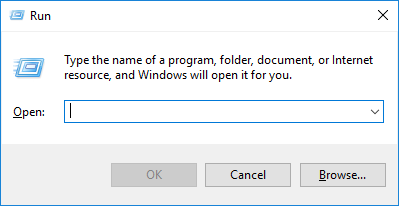
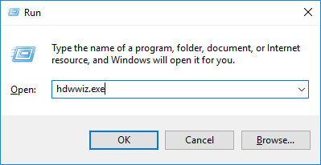
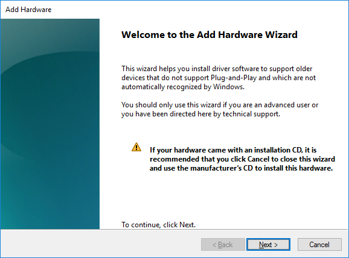
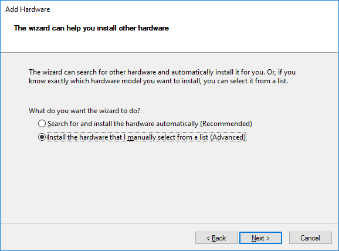
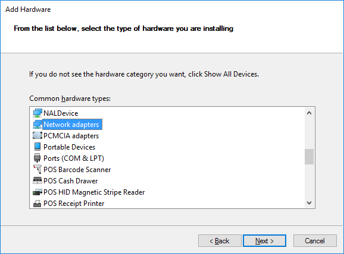
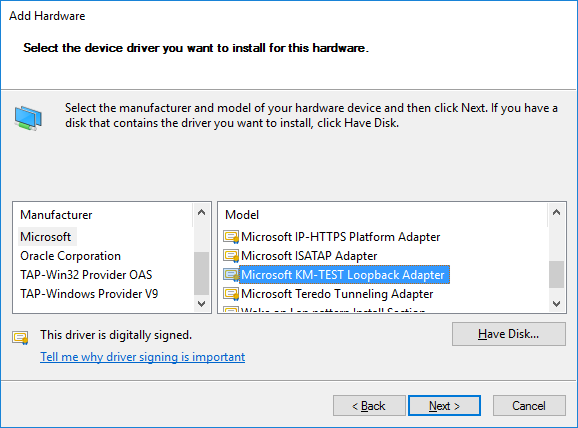
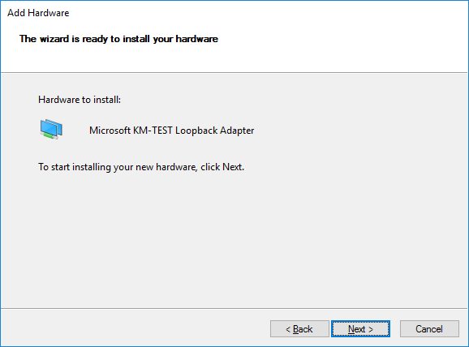
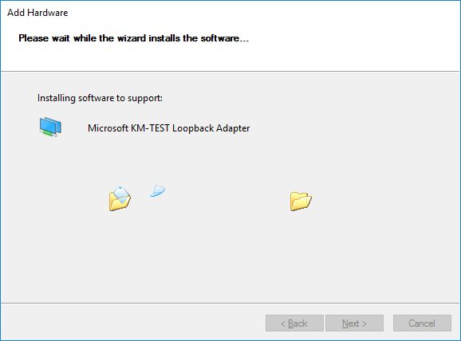
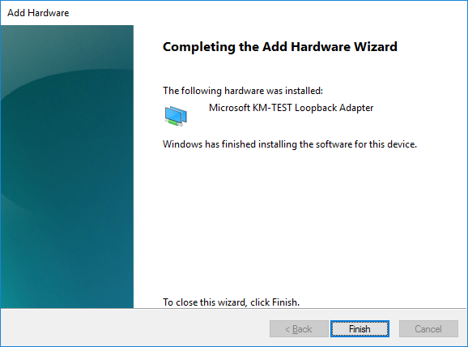

# How to install Microsoft KM-TEST Loopback Adapter in window OS?

## Step 1: Open `Run` desktop app by pressing window key + R

## Step 2: Type `hdwwiz.exe` and press `OK` button

## Step 3: Allow app to make change in your PC by pressing `Yes` button. You will be prompt to following window. Press `Next` button

## Step 4: Select second radio button and press `Next` button

## Step 5: Select Network adapters as hardware type and press `Next` button

## Step 6: Select Microsoft as Manufacturer and Microsoft KM-TEST Loopback Adapter as Model. Press `Next` button

## Step 7: The wizard is ready to install, press `Next` button

## Step 8: Please wait…

## Step 9: Finish the installation by pressing Finish button

